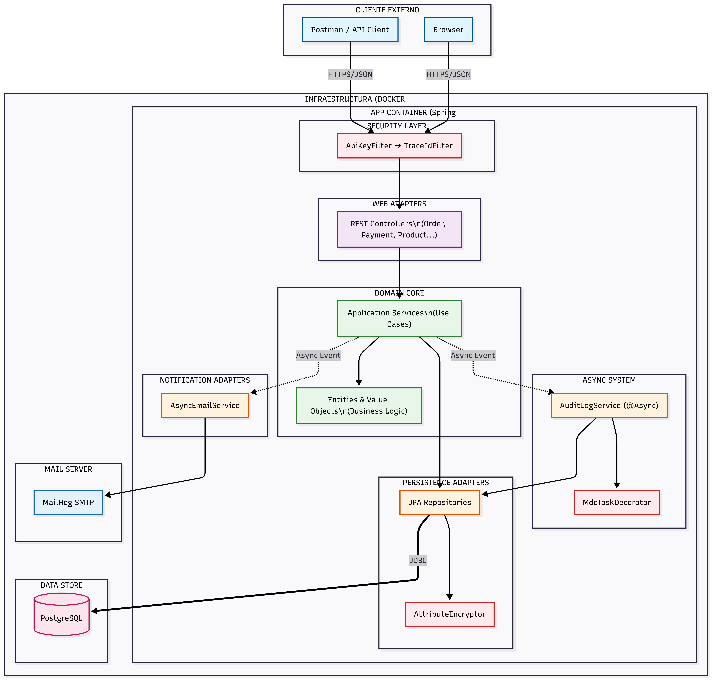

# Sistema Backend E-commerce

Aplicación Backend completa para sistema de E-commerce con procesamiento de pagos, tokenización de tarjetas de crédito y gestión de órdenes.

## 1. Descripción del Sistema y Componentes

Este proyecto es una **API Backend** para una plataforma de E-commerce que gestiona clientes, catálogo de productos, carrito de compras, tokenización de tarjetas de crédito y procesamiento de órdenes con simulación de pagos.

### Arquitectura



La aplicación sigue el patrón de **Arquitectura Hexagonal (Ports and Adapters)** con una separación estricta de capas:
```
com.farmatodo.reto_tecnico/
├── domain/                    # Lógica de negocio pura (SIN dependencias de framework)
│   ├── model/                # Entidades de dominio y value objects
│   ├── port/
│   │   ├── in/              # Interfaces de casos de uso (input ports)
│   │   └── out/             # Interfaces de repositorios/gateways (output ports)
│   └── exception/           # Excepciones de dominio
│
├── application/              # Orquestación de casos de uso
│   └── service/             # Implementaciones de servicios
│
└── infrastructure/           # Integraciones con frameworks externos
    ├── adapter/
    │   ├── in/rest/         # Controllers, DTOs, Mappers
    │   └── out/             # JPA Entities, Repositories, Adapters
    └── config/              # Configuración de infraestructura
```

### Stack Tecnológico

| Categoría | Tecnología |
|-----------|------------|
| Lenguaje | Java 21 |
| Framework | Spring Boot 3.3.5 |
| Base de Datos | PostgreSQL 16 |
| Contenedores | Docker & Docker Compose |
| Build Tool | Maven |
| Generación de Código | Lombok, MapStruct |
| Documentación API | SpringDoc OpenAPI (Swagger) |
| Testing | JUnit 5, Mockito, Testcontainers |
| Cobertura de Código | JaCoCo (requisito mínimo 80%) |
| Testing de Email | MailHog |

---

## 2. Instrucciones para Ejecutar Localmente

### Prerrequisitos

- **Java 21** (JDK)
- **Docker** y **Docker Compose**
- **Maven 3.8+** (o usar el Maven Wrapper incluido `./mvnw`)

### Paso 1: Clonar el Repositorio
```bash
git clone https://github.com/Sebasr22/farmatodo-backend-challenge
cd farmatodo-backend-challenge
```

### Paso 2: Configurar Variables de Entorno

Copiar el archivo de entorno de ejemplo:
```bash
cp .env.example .env
```

Editar el archivo `.env` con los valores deseados:
```properties
# Configuración de Base de Datos
DB_PASSWORD=your_secure_password
DB_USER=postgres
DB_NAME=farmatodo_db
DB_PORT=5432
DB_HOST=farmatodo-postgres

# Seguridad de la Aplicación
ENCRYPTION_KEY=change_this_to_a_secure_random_key_minimum_32_characters
API_KEY=change_this_to_a_secure_api_key

# Configuración SMTP (MailHog)
SPRING_MAIL_HOST=mailhog
SPRING_MAIL_PORT=1025

# Puerto de la Aplicación
APP_PORT=8080
```

### Paso 3: Iniciar la Aplicación

Ejecutar todos los servicios con Docker Compose:
```bash
docker compose up -d --build
```

Este comando realizará lo siguiente:
1. Construir la imagen de la aplicación Spring Boot
2. Iniciar la base de datos PostgreSQL 16
3. Iniciar el servidor de email MailHog
4. Iniciar el contenedor de la aplicación

### Paso 4: Verificar los Servicios

| Servicio | URL/Puerto | Descripción |
|----------|------------|-------------|
| **API** | `http://localhost:8080` | Aplicación principal |
| **Swagger UI** | `http://localhost:8080/swagger-ui.html` | Documentación de la API |
| **Health Check** | `http://localhost:8080/ping` | Estado de la aplicación |
| **MailHog UI** | `http://localhost:8025` | Interfaz de testing de emails |
| **PostgreSQL** | `localhost:5432` | Base de datos |

### Comandos Útiles
```bash
# Ver logs
docker compose logs -f app

# Detener todos los servicios
docker compose down

# Detener y eliminar volúmenes (limpiar base de datos)
docker compose down -v

# Reconstruir solo la aplicación
docker compose up -d --build app
```

---

## 3. Despliegue en GCP y CI/CD (Live Demo)

La aplicación está desplegada en una Máquina Virtual (Compute Engine) de Google Cloud Platform, orquestada mediante Docker y utilizando Nginx como servidor web y proxy inverso. La gestión de DNS y el apuntamiento del subdominio se realizan a través de Cloudflare. El proyecto dispone de un pipeline de Integración Continua / Despliegue Continuo (CI/CD) completamente automatizado.

### Ejemplo de Entorno Productivo

> **Nota:** Estas son URLs de ejemplo de un despliegue previo. Reemplazar con tu propio dominio al desplegar.

- **URL Base API:** `https://ft-api.srodriguez-tech.com`
- **Documentación API (Swagger):** https://ft-api.srodriguez-tech.com/swagger-ui/index.html
- **Health Check:** `https://ft-api.srodriguez-tech.com/ping`
- **Pipeline CI/CD (GitHub Actions):** https://github.com/Sebasr22/farmatodo-backend-challenge/actions

### Arquitectura de Despliegue

La aplicación está desplegada con la siguiente arquitectura:

- **Infraestructura:** Google Cloud Platform (Compute Engine VM)
- **Orquestación:** Docker Compose
- **Servidor Web:** Nginx como reverse proxy
- **DNS:** Cloudflare
- **CI/CD:** GitHub Actions con despliegue automático en cada push a `main`

**Flujo de despliegue automatizado:**
1. Los tests se ejecutan en GitHub Actions
2. Si pasan, el código se copia a la VM vía SSH
3. Se genera el archivo `.env` con secretos de GitHub
4. Docker Compose reconstruye y levanta los contenedores
5. Nginx redirige el tráfico HTTPS al contenedor de la app

---

## 4. Cómo Ejecutar los Tests

El proyecto incluye **Tests Unitarios** y **Tests de Integración** con Testcontainers.

### Ejecutar Todos los Tests
```bash
# Usando Maven Wrapper (recomendado)
./mvnw clean test

# En Windows
mvnw.cmd clean test
```

### Ejecutar Tests con Reporte de Cobertura
```bash
./mvnw clean verify
```

El reporte de cobertura se generará en: `target/site/jacoco/index.html`

**Nota:** El proyecto exige un mínimo de **80% de cobertura de código** mediante JaCoCo.

### Ejecutar Tests Específicos
```bash
# Ejecutar una clase de test específica
./mvnw test -Dtest=CustomerServiceImplTest

# Ejecutar un método de test específico
./mvnw test -Dtest=CustomerServiceImplTest#shouldRegisterCustomerSuccessfully
```

### Categorías de Tests

| Tipo | Descripción | Ubicación |
|------|-------------|-----------|
| Tests Unitarios | Lógica de dominio sin contexto de Spring | `src/test/java/**/domain/**` |
| Tests de Servicios | Servicios de aplicación con dependencias mockeadas | `src/test/java/**/application/**` |
| Tests de Integración | Stack completo con Testcontainers | `src/test/java/**/infrastructure/**` |
| Tests de Controllers | Endpoints REST con MockMvc | `src/test/java/**/rest/**` |

---

## 5. Pruebas y Documentación API (Postman)

Todos los recursos necesarios para probar la API se encuentran organizados en la carpeta `resources/postman`.

### Configuración Inicial

1. **Importar Environment:** Cargar el archivo `resources/postman/environments/dev.postman_environment.json`.

2. **Seleccionar Environment:** Asegurarse de tener seleccionado "dev" en Postman antes de ejecutar cualquier petición.

### Colecciones Disponibles

Hemos incluido 2 colecciones especializadas en la carpeta `resources/postman/collections`:

#### A. E-commerce - Data-Driven Tests

- **Enfoque:** Pruebas de validación masiva con datos externos.

- **Cómo ejecutar:**
  1. Abrir el Collection Runner en Postman.
  2. Seleccionar la carpeta/request deseada (Marcadas con (Done)).
  3. Cargar el archivo CSV correspondiente desde `resources/postman/data/`.
  4. Ejecutar.

- **Archivos CSV Disponibles:**
  - `order_tests.csv`: Validaciones de creación de órdenes.
  - `cart_tests.csv`: Validaciones de límites y errores del carrito.
  - `customer_tests.csv`: Validaciones de registro de clientes.
  - `cards_tokenization_tests.csv`: Validaciones de tokenización de tarjetas.

#### B. E-commerce - E2E Flows

- **Enfoque:** Flujos "End-to-End" completos y autónomos.

- **Descripción:** Esta colección NO requiere archivos CSV. Utiliza scripts internos (Pre-request Scripts) para generar datos aleatorios (Emails únicos, Teléfonos, Tarjetas) en cada ejecución.

- **Uso ideal:** Validar rápidamente que todo el sistema funciona (Happy Path) sin configurar datos manualmente. Solo presionar el botón "Run".

---

### Resumen de Endpoints de la API

Para documentación completa de la API, visitar [Swagger UI](https://ft-api.srodriguez-tech.com/swagger-ui/index.html)

---
