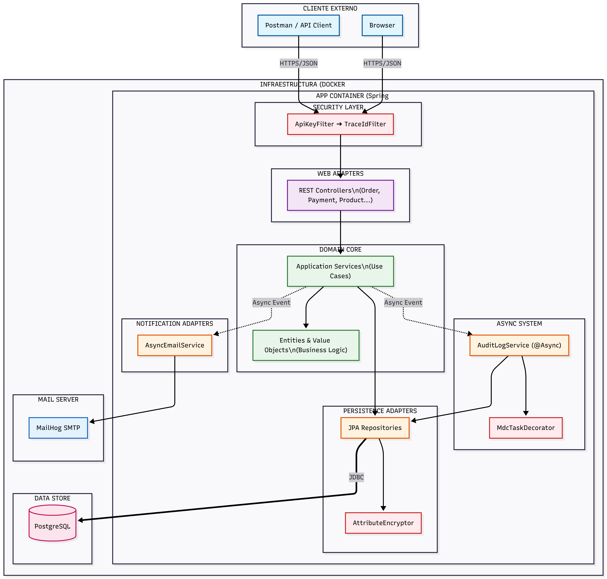

# E-commerce Backend API

**English** | [Español](README.es.md)

Backend application for an e-commerce platform with payment processing, credit card tokenization, and order management.

## 1. System Overview and Components

This project is a **Backend API** for an e-commerce platform that manages customers, a product catalog, shopping carts, credit card tokenization, and order processing with payment simulation.

### Architecture



The application follows the **Hexagonal Architecture (Ports and Adapters)** pattern with strict layer separation:
```
src/main/java/

├── domain/                    # Pure business logic (NO framework dependencies)
│   ├── model/                # Domain entities and value objects
│   ├── port/
│   │   ├── in/              # Use case interfaces (input ports)
│   │   └── out/             # Repository/gateway interfaces (output ports)
│   └── exception/           # Domain exceptions
│
├── application/              # Use case orchestration
│   └── service/             # Service implementations
│
└── infrastructure/           # Integrations with external frameworks
    ├── adapter/
    │   ├── in/rest/         # Controllers, DTOs, Mappers
    │   └── out/             # JPA Entities, Repositories, Adapters
    └── config/              # Infrastructure configuration
```

### Tech Stack

| Category | Technology |
|----------|------------|
| Language | Java 21 |
| Framework | Spring Boot 3.3.5 |
| Database | PostgreSQL 16 |
| Containers | Docker & Docker Compose |
| Build Tool | Maven |
| Code Generation | Lombok, MapStruct |
| API Documentation | SpringDoc OpenAPI (Swagger) |
| Testing | JUnit 5, Mockito, Testcontainers |
| Code Coverage | JaCoCo (80% minimum required) |
| Email Testing | MailHog |

---

## 2. Running Locally

### Prerequisites

- **Java 21** (JDK)
- **Docker** and **Docker Compose**
- **Maven 3.8+** (or use the included Maven Wrapper `./mvnw`)

### Step 1: Clone the Repository
```bash
git clone https://github.com/Sebasr22/springboot-ecommerce-api
cd springboot-ecommerce-api
```

### Step 2: Configure Environment Variables

Copy the example environment file:
```bash
cp .env.example .env
```

Edit the `.env` file with your values:
```properties
# Database Configuration
DB_PASSWORD=your_secure_password
DB_USER=postgres
DB_NAME=ecommerce_db
DB_PORT=5432
DB_HOST=ecommerce-postgres

# Application Security
ENCRYPTION_KEY=change_this_to_a_secure_random_key_minimum_32_characters
API_KEY=change_this_to_a_secure_api_key

# SMTP Configuration (MailHog)
SPRING_MAIL_HOST=mailhog
SPRING_MAIL_PORT=1025

# Application Port
APP_PORT=8080
```

### Step 3: Start the Application

Run all services with Docker Compose:
```bash
docker compose up -d --build
```

This command will:
1. Build the Spring Boot application image
2. Start the PostgreSQL 16 database
3. Start the MailHog email server
4. Start the application container

### Step 4: Verify the Services

| Service | URL/Port | Description |
|---------|----------|-------------|
| **API** | `http://localhost:8080` | Main application |
| **Swagger UI** | `http://localhost:8080/swagger-ui.html` | API documentation |
| **Health Check** | `http://localhost:8080/ping` | Application status |
| **MailHog UI** | `http://localhost:8025` | Email testing interface |
| **PostgreSQL** | `localhost:5432` | Database |

### Useful Commands
```bash
# View logs
docker compose logs -f app

# Stop all services
docker compose down

# Stop and remove volumes (reset the database)
docker compose down -v

# Rebuild only the application
docker compose up -d --build app
```

---

## 3. GCP Deployment and CI/CD

The application was deployed on a Google Cloud Platform virtual machine (Compute Engine), orchestrated with Docker and using Nginx as web server and reverse proxy. DNS and subdomain routing are managed through Cloudflare. The project includes a fully automated Continuous Integration / Continuous Deployment (CI/CD) pipeline.

> **Note:** The live demo from the previous deployment is currently offline. You can run the full stack locally in a few minutes by following [Section 2](#2-running-locally).

- **CI/CD Pipeline (GitHub Actions):** https://github.com/Sebasr22/springboot-ecommerce-api/actions

### Deployment Architecture

- **Infrastructure:** Google Cloud Platform (Compute Engine VM)
- **Orchestration:** Docker Compose
- **Web Server:** Nginx as reverse proxy
- **DNS:** Cloudflare
- **CI/CD:** GitHub Actions with automatic deployment on every push to `main`

**Automated deployment flow:**
1. Tests run on GitHub Actions
2. If they pass, the code is copied to the VM via SSH
3. The `.env` file is generated from GitHub Secrets
4. Docker Compose rebuilds and starts the containers
5. Nginx routes HTTPS traffic to the application container

---

## 4. Running the Tests

The project includes **Unit Tests** and **Integration Tests** with Testcontainers.

### Run All Tests
```bash
# Using the Maven Wrapper (recommended)
./mvnw clean test

# On Windows
mvnw.cmd clean test
```

### Run Tests with Coverage Report
```bash
./mvnw clean verify
```

The coverage report is generated at: `target/site/jacoco/index.html`

**Note:** The build enforces a minimum of **80% code coverage** through JaCoCo.

### Run Specific Tests
```bash
# Run a specific test class
./mvnw test -Dtest=CustomerServiceImplTest

# Run a specific test method
./mvnw test -Dtest=CustomerServiceImplTest#shouldRegisterCustomerSuccessfully
```

### Test Categories

| Type | Description | Location |
|------|-------------|----------|
| Unit Tests | Domain logic without Spring context | `src/test/java/**/domain/**` |
| Service Tests | Application services with mocked dependencies | `src/test/java/**/application/**` |
| Integration Tests | Full stack with Testcontainers | `src/test/java/**/infrastructure/**` |
| Controller Tests | REST endpoints with MockMvc | `src/test/java/**/rest/**` |

---

## 5. API Testing and Documentation (Postman)

All resources needed to test the API are organized in the `resources/postman` folder.

### Initial Setup

1. **Import the Environment:** Load `resources/postman/environments/dev.postman_environment.json`.

2. **Select the Environment:** Make sure "dev" is selected in Postman before running any request.

### Available Collections

Two specialized collections are included in `resources/postman/collections`:

#### A. E-commerce - Data-Driven Tests

- **Focus:** Bulk validation tests using external data.

- **How to run:**
  1. Open the Collection Runner in Postman.
  2. Select the desired folder/request (marked with (Done)).
  3. Load the corresponding CSV file from `resources/postman/data/`.
  4. Run.

- **Available CSV files:**
  - `order_tests.csv`: Order creation validations.
  - `cart_tests.csv`: Cart limits and error validations.
  - `customer_tests.csv`: Customer registration validations.
  - `cards_tokenization_tests.csv`: Card tokenization validations.

#### B. E-commerce - E2E Flows

- **Focus:** Complete, self-contained end-to-end flows.

- **Description:** This collection does NOT require CSV files. It uses pre-request scripts to generate random data (unique emails, phone numbers, cards) on every run.

- **Best for:** Quickly validating that the whole system works (happy path) without setting up data manually. Just press "Run".

---

### API Endpoints

For the full API documentation, run the project locally and open [Swagger UI](http://localhost:8080/swagger-ui.html).
